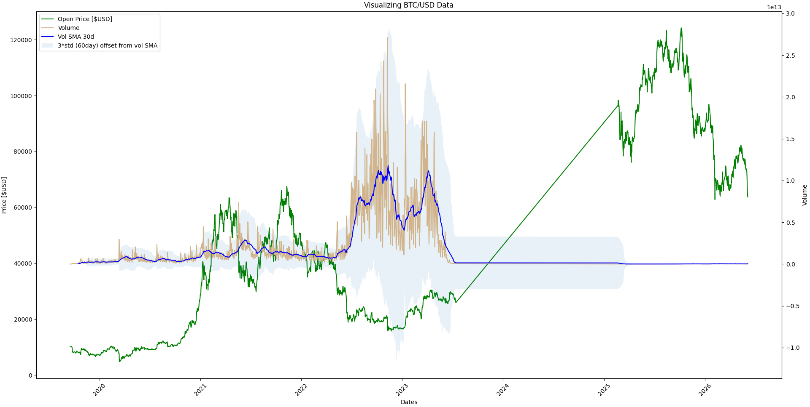

# Data Vis Project

This project is built to be a playground exploring different matplotlib features and technical analysis on a generic dataset.

## What's Included?
1. get-data.py: this file pulls data from Binance and pre-processes it into a pickle file to be used by other parts of this project. Data is not included in this repo, but can be generated fairly quickly.

    Binance data explanation here: https://support.binance.us/en/articles/9843310-introducing-historical-market-data-from-binance-us-download-for-free?utm_source=chatgpt.com
    Binance data web explorer: https://www.binance.us/finder?dpath=public_data%2Fspot%2Fdaily%2Fklines%2FBTCUSD%2F1d

2. DataVis.py: this file plots some basic items over the range of data available.

# Known data problems
get-data.py errors out at 2023-07-14 through 2025-02-20 due to missing data from Binance on the 1d timescale.

## Current Progress as of 06/01/2026:
Basic plots generated from DataVis.py

